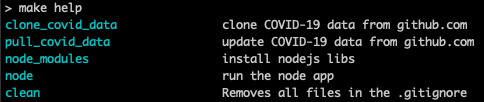

# About the project

This projects was started to make it easier to import the covid-19
data from John Hopkins into a [google
sheet](https://docs.google.com/spreadsheets/d/1kCfWxRrL3lm3CgVDS5wYZRad-8ogexNL5NZgpoR0IwY/edit?usp=sharing)
and perform additional calculations on the data.

Currently the sheet is looking at countries of interest such as those
with a large infection rate, similar infection rate or comparable to
the United States, or of other particular interests.  For example,
Sweden and India were selected because of their approach and China
because of the early outbreak there.

The current additional calculates are to compute the doubling rate by
days, % of the country population infected, % of the population that
dies, and the day over day increase of infection and deaths.  This
information is used to provide a projection of what might occur in the
future.  See the "daily projection" tab in the [google
sheet](https://docs.google.com/spreadsheets/d/1kCfWxRrL3lm3CgVDS5wYZRad-8ogexNL5NZgpoR0IwY/edit?usp=sharing#gid=196962846).

## doubling rate by days

The doubling rate calculated in days provides a more comprehensible
number to understand how fast the infections are growing or slowing.

## % of the country population infected

The % of the country population makes it possible to compare one
countries numbers to the other.  While I pretty sure this is not
perfect due to several factors I can think of such as, geography, and
other factors influencing the infection rates.

## % of the country population die

The % of the country population makes it possible to compare one
countries numbers to the other.  While I pretty sure this is not
perfect due to several factors I can think of such as, geography,
wealth, health awareness and preparation, and if the medical system
is overwhelmed by the number of infections and other factors
influencing the infection rates.

## Population Data

I pulled in the country population data from
(https://www.macrotrends.net/).  This site seemed like the easiest to
consume and reference.  If you have better data, I would love to take
a look and possible swap it out.  The population data references is
still a manual effort.  It would be nice to automate loading load this
data.

## Daily Stats By Country and daily projection

The calculated statistics are loaded into the
"[daily_stats_by_country](https://docs.google.com/spreadsheets/d/1kCfWxRrL3lm3CgVDS5wYZRad-8ogexNL5NZgpoR0IwY/edit#gid=663874122)"
tab of the google sheet.  The manual proto type for this is in the
"[percent population](https://docs.google.com/spreadsheets/d/1kCfWxRrL3lm3CgVDS5wYZRad-8ogexNL5NZgpoR0IwY/edit#gid=997476041)"
tab which is still manually updated when new data is loaded from John
Hopkins.

The "[daily projection](https://docs.google.com/spreadsheets/d/1kCfWxRrL3lm3CgVDS5wYZRad-8ogexNL5NZgpoR0IwY/edit#gid=196962846)"
tab is still driven off the manually updated "percent population" tab
and will be updated to use the generated "daily_stats_by_country"
shortly."  [Historic Events](https://docs.google.com/spreadsheets/d/1kCfWxRrL3lm3CgVDS5wYZRad-8ogexNL5NZgpoR0IwY/edit#gid=1769981891)
have been manually imported with links to the source sites to provide
context to the number of US deaths that have occurred.

# Getting Started

This project is configured to use 'make' to execute the
[Node.js](https://nodejs.org/) code.  To run the project for the first
time, make sure you have node and npm installed in your path and run
'make node'.  The Makefile dependencies are setup to use npm to import
the needed Node.js libraries and check out the covid-19 data provide
by John Hopkins from GitHub.  To get a list of available make targets
run 'make help' or 'make' without any parameters as 'help' is the
default target.

Below is an example of using 'make help'.

## TODO:

There is still a bit of clean up needed.  Below is a TODO list to keep
track.

* Revise README.md setup guide using a clean system setup and install.
* move all references to use SPREADSHEET_ID constant from local vars.
* review index.js for other vars that should be constants or globals
  vars.
* add configuration option to externalize SPREADSHEET_ID and file
  paths (CVS data, etc)
* more research on async and await behavior.  Currently, using
  callback functions.  See TODO in "loadConfirmedGlobalLookup"
  function

# Manual Install and Run Notes
1. install Node.js, npm, and nvm
https://docs.npmjs.com/downloading-and-installing-node-js-and-npm
setup nvm
https://github.com/nvm-sh/nvm

2. Install the client library
This can be done using 'make node_modules' after node and npm are installed and available in your PATH.
https://developers.google.com/sheets/api/quickstart/nodejs#step_2_install_the_client_library
npm install googleapis@39 --save

3. Run
This can be done using 'make node' after node and npm are installed and available in your PATH.
node .

# References:

## John Hopkins project
GitHub data
https://github.com/CSSEGISandData/COVID-19

Visual Dashboard (desktop):
https://www.arcgis.com/apps/opsdashboard/index.html#/bda7594740fd40299423467b48e9ecf6

## Authorize Sheets Requests
https://developers.google.com/sheets/api/guides/authorizing

## API Refs
### spreadsheets/batchUpdate
https://developers.google.com/sheets/api/reference/rest/v4/spreadsheets/batchUpdate
const sheets = google.sheets({version: 'v4', auth});
sheets.spreadsheets.batchUpdate({

### spreadsheets.values/update
https://developers.google.com/sheets/api/reference/rest/v4/spreadsheets.values/update
sheets.spreadsheets.values.update(request)

## Import CVS to google sheet
A Cloud Function to automate Google Spreadsheet CSV import
https://medium.com/google-cloud/a-cloud-function-to-automate-google-spreadsheet-csv-import-d2ffb8fbe9b4

## Markdown Preview Plus
Having a local way to view Markdown is very helpful.  The [Markdown
Preview
Plus](https://chrome.google.com/webstore/detail/markdown-preview-plus/febilkbfcbhebfnokafefeacimjdckgl)
chrome plugin does a pretty good job and make is a lot easier to
revise markdown code before pushing to GitHub.  I found a thread
referencing the plugin on [stackoverflow]
(https://stackoverflow.com/questions/9843609/view-markdown-files-offline).

## Markdown Cheatsheet
I always seem to land on this [Markdown
Cheatsheet](https://github.com/adam-p/markdown-here/wiki/Markdown-Cheatsheet)
when looking for a reference, so I added a reference.